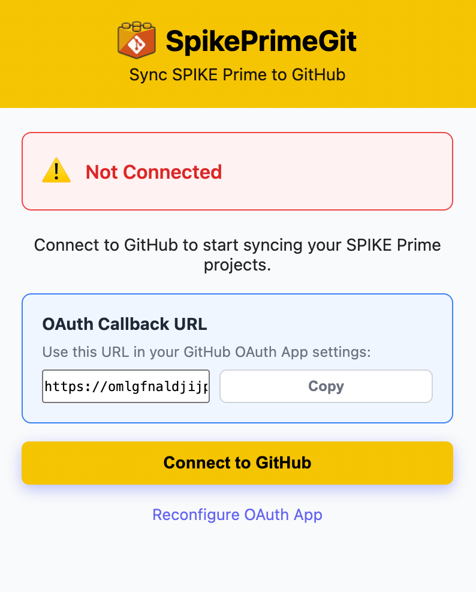
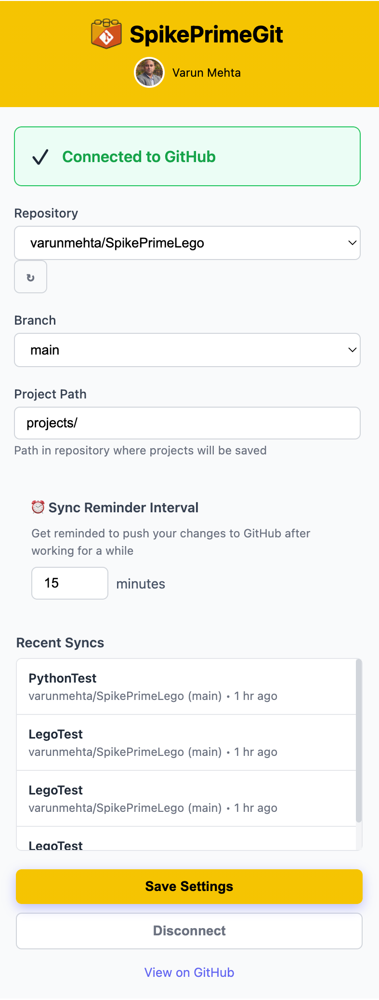
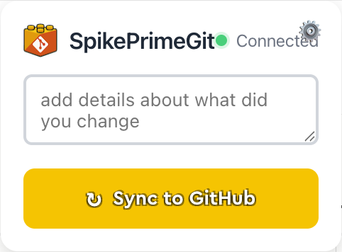

# SpikePrimeGit

> Automatically sync your LEGO SPIKE Prime projects to GitHub!

**SpikePrimeGit** is a Chrome extension that helps you back up your LEGO SPIKE Prime projects to GitHub. Every time you save a project in SPIKE Prime, it's allows you to sync the `.llsp3` file to your GitHub repository.

[](https://chromewebstore.google.com/detail/spikeprimegit/ldiklhfinipoikhmfbnamjklkigcppoe)

  [](https://chromewebstore.google.com/detail/spikeprimegit/ldiklhfinipoikhmfbnamjklkigcppoe)
  [](https://chromewebstore.google.com/detail/spikeprimegit/ldiklhfinipoikhmfbnamjklkigcppoe)
  [](https://chromewebstore.google.com/detail/spikeprimegit/ldiklhfinipoikhmfbnamjklkigcppoe)
---

## ✨ Features

- 🎯 **One-Click Setup** - Simple GitHub authentication, no complex configuration
- ⚡ **Auto-Capture** - Automatically detects when you save projects
- 📦 **Version Control** - Every save creates a Git commit with your custom message
- 🔄 **Upload Support** - Works with both new projects and uploaded `.llsp3` files
- 📊 **Sync History** - Track all your uploads in the popup
- 🔐 **Privacy First** - No data collection, direct GitHub communication
- 🎨 **Native UI** - Integrated sync button and notifications on SPIKE Prime page

---
## Screenshots

### Pre-Login Screen 



### Post Login Screen


### Sync with GitHub Button



---


## 🚀 Quick Start

### 1. Install Extension

**Chrome Web Store (Recommended):**
1. Visit the [Chrome Web Store](https://chrome.google.com/webstore) _(link pending)_
2. Click **"Add to Chrome"**
3. Click **"Add extension"**

**From Source (Developer Mode):**
1. Download this repository as ZIP and extract it
2. Open Chrome and go to `chrome://extensions/`
3. Enable **"Developer mode"** (toggle in top-right)
4. Click **"Load unpacked"** and select the extracted folder

### 2. Connect to GitHub

1. Click the **SpikePrimeGit** icon in Chrome toolbar
2. Click **"Connect to GitHub"**
3. Authorize the extension on GitHub
4. Select repositories you want to sync to

### 3. Configure Settings

1. Select your **repository** from the dropdown
2. Select your **branch** (usually `main`)
3. Set **project path** (e.g., `projects/` - where files will be saved)
4. Click **"Save Settings"**

### 4. Start Syncing!

Open https://spike.legoeducation.com and try one of these workflows:

**For New Projects:**
1. Create a new project in SPIKE Prime
2. Save it (the extension captures it automatically)
3. Enter a commit message in the SpikePrimeGit card
4. Click **"Sync to GitHub"** ✅

**For Uploaded Projects:**
1. Upload an existing `.llsp3` file to SPIKE Prime
2. Make changes and save
3. The extension captures your saves automatically
4. Click **"Sync to GitHub"** with a commit message ✅

---

### Commit Messages

Every sync creates a commit with:
- Your custom message (entered in the UI)
- Project name
- Timestamp

Example commit:
```
Added motor control logic
```

---

## 🎓 Usage Guide

### Syncing Workflow

1. **Work in SPIKE Prime** as you normally would
2. **Save your project** - extension captures it automatically
3. **Open the SpikePrimeGit card** on the page (injected by extension)
4. **Enter a commit message** describing your changes
5. **Click "Sync to GitHub"** - done! ✅

### Viewing Your Projects

Your projects are saved as `.llsp3` files in your repository:

```
your-repo/
  └── projects/
      ├── MyRobot.llsp3
      ├── LineFollower.llsp3
      └── CompetitionReady.llsp3
```

**To view version history:**
1. Go to your GitHub repository
2. Navigate to the projects folder
3. Click any `.llsp3` file
4. Click **"History"** to see all versions
5. Click any commit to see when it was saved
6. Download any version to restore it

---

## 🔐 Privacy & Security

- ✅ **Zero Telemetry** - No analytics or tracking
- ✅ **Local Storage** - Tokens stored securely in your browser
- ✅ **Direct Communication** - Extension talks directly to GitHub API
- ✅ **Open Source** - All code available for inspection
- ✅ **OAuth 2.0** - Industry-standard secure authentication
- ✅ **No Backend** - No third-party servers, no data leaves your control

---

## 🐛 Troubleshooting

### "No project captured yet" Error

**Problem:** You clicked "Sync to GitHub" but no project is captured.

**Solutions:**
1. Make sure you **saved** the project in SPIKE Prime first
2. Try saving again (Ctrl+S or Cmd+S)
3. Check console (F12) for `[SpikePrimeGit:interceptor]` logs
4. If you uploaded a file, make sure to save it at least once

### "Extension context invalidated" Error

**Problem:** Extension was reloaded while page was open.

**Solution:**
1. Simply **refresh the SPIKE Prime page** (F5)
2. The extension will reconnect automatically

### "Not Connected" Status

**Problem:** Extension shows "Not Connected" in popup.

**Solutions:**
1. Click extension icon
2. Click **"Connect to GitHub"** again
3. Complete authorization on GitHub
4. Select repositories when prompted

### "Please select a repository and branch"

**Problem:** Settings not configured.

**Solution:**
1. Click extension icon
2. Select repository from dropdown
3. Select branch
4. Click **"Save Settings"**

### Projects not appearing on GitHub

**Solutions:**
1. Check you're looking at the **correct branch**
2. Verify **project path** matches your settings (e.g., `projects/`)
3. Check repository **commits** to see if files are being created
4. Open browser console (F12) and look for errors

### Need More Help?

- Open an issue on [GitHub Issues](../../issues)
- Check the [CONTRIBUTE.md](CONTRIBUTE.md) for development details
- Enable debug logging (see [CONTRIBUTE.md](CONTRIBUTE.md))

---

## 🤝 Contributing

Contributions are welcome! See [CONTRIBUTE.md](CONTRIBUTE.md) for:
- Development setup
- Architecture overview
- Testing guidelines
- Pull request process

---

## 📄 License

This project is provided as-is for educational purposes.

---

## 📚 Additional Resources

- **Chrome Web Store Listing** - _(link pending)_
- **GitHub Repository** - [View Source](https://github.com/yourusername/spikeprimegit)
- **Report Issues** - [GitHub Issues](../../issues)
- **Contribute** - [CONTRIBUTE.md](CONTRIBUTE.md)

---

**Made with ❤️ for LEGO Education enthusiasts**

Never lose your SPIKE Prime projects again! 🧱🤖

---

> **Disclaimer:** This extension was built using [`claude code`](https://www.claude.com/product/claude-code) as a coding partner.
